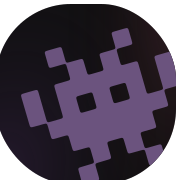

# Портфолио (Nuxt 4) 

[English](/README.md) | **Russian**

Современный портфолио-сайт, построенный на **Nuxt 4 и его фичах**.

Цель проекта — показать мои профессиональные навыки веб-разработки. Показать мои проекты в удобном виде.

Доступен по адресу [thejenja.github.io](https://thejenja.github.io)

## Фишки 💡

- Анимации: через GSAP, CSS transitions, Vue transitions (с поддержкой `prefers-reduced-motion`)
- Фильтрация проектов по технологиям, типам, стадиям, цветам
- Галерея проектов с каруселью и сеткой
- Социальные ссылки с группировкой по категориям

## Стек 🤓

- **Фреймворк**: [Nuxt 4](https://nuxt.com)
- **Стилизация**: CSS с переменными
- **Анимации**: GSAP, CSS/Vue transitions
- **Иконки**: Lucide Icons, Simple Icons, кастомные SVG

## Установка и запуск 🛠

```bash
# Клонируем
git clone https://github.com/thejenja/thejenja.github.io.git
cd thejenja.github.io

# Ставим зависимости
npm install

# Запускаем
npm run dev

# Сборка для продакшена
npm run build
npm run preview
```
